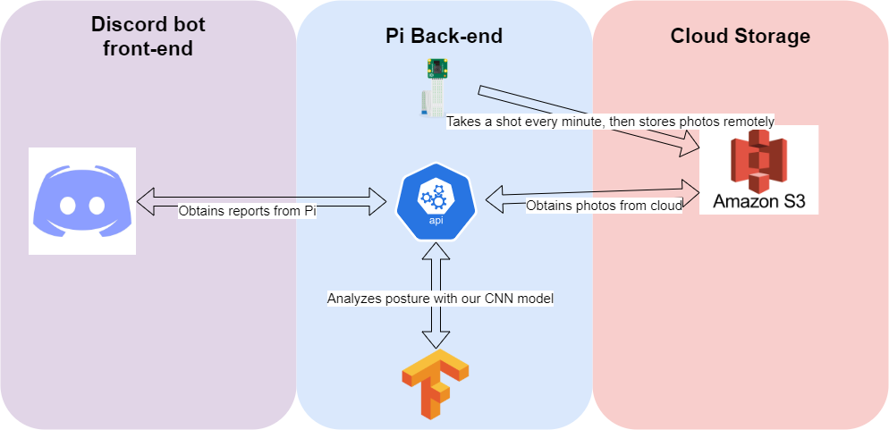

# PiPosture
A Discord bot that works with your Raspberry Pi to take snapshots and analyze your sitting posture through a self-trained CNN model! This was made for a 24 hour hackathon (NWHacks at the University of British Columbia) by a team that consists of a mix of intermediate to beginner 'hackers'. As such, this is very much a prototype project, but it has been built to allow for anyone to pick up and continue this work later on!

Here is a basic 'snapshot' of the project architecture that we utilized:

The DevPost submission can be found [here](https://devpost.com/software/piposture?ref_content=user-portfolio&ref_feature=in_progress).

The YouTube pitch that goes through a brief summary of our solution and demos the individual parts can be found here:

> Our pitch was cobbled up together by one of our team members in 30 minutes due to time constraints, so please excuse the lack of production quality. The main focus of it is to introduce the cool different aspects we worked with and present our end result after 24 hours!

### Requirements
On your Raspberry Pi, you will need to install the following:
- Every pip install as detailed in the `requirements.txt`
- Tensorflow 2+, [instructions here](https://www.youtube.com/watch?v=GNRg2P8Vqqs)

You will also need access to a [Raspberry Pi Camera Module](https://projects.raspberrypi.org/en/projects/getting-started-with-picamera), and its related libraries such at PiCamera.

> Note: due to time constraints, we have not tried building this project from scratch on a brand new Raspberry Pi image, so download at your own risk!

To fully utilize the Cloud stack, you will also need an AWS S3 subscription.

Our Discord bot ran locally for the demo, but it can be deployed if you have access to a SaaS that provides it.

## Project Architecture

### How We built it

The **Discord bot** was built using Python following the Discord API documentation.

The **image taker** that talks to our cloud storage was built using Python and communicates to AWS's S3 service to store the data. Automation was achieved through a Cron task.

The **'posture' API** was built using the Flask framework and its RESTful API example codes. It serves as a back-end that 

Our **CNN model** utilized Keras and OpenCV libraries with Tensorflow, and it was self-trained using photos we took through the 24 hours.

### Design Choices

**Why Raspberry Pi?**

We chose to go with a Raspberry Pi + Camera module due to the following reasons:
- Rapid hardware prototyping: this acts as a proof-of-concept for potential upgrades to USB webcams, or even dedicated PCB modules
- Cheap costs + hobbyist support: you can set up this project for around $150 max. (Pi + Camera module), compared to setting this up with a USB webcam and a dedicated computer ($???)
- Better photo angle: using a Laptop front camera would make it hard to analyze your back posture; it is an overdone idea whereas analyzing posture based on back/side views were relatively untouched when we researched

**Why Discord bot?**

- Interest: something we wanted to work on!
- Ease of use: Discord bots are something many people have worked with and are starting to be more familiar with
- Accessible platform: As a growing platform for collaboration, especially with the presence of COVID-19, people can easily incorporate this bot into their workflow

## Our Mission
With the continued presence of COVID-19 in 2021, many students and professionals are now forced to study/work/be productive at home. One problem that this working environment has created is the increased time spent sitting in front of a desk. We created this Discord bot to remind the growing population of people working from home to protect our backs against the damaging effects of sitting with bad posture and to maintain a healthy work-from-home environment.

## Features

- ✅ Generate daily reports on your back posture based on a ML model, obtainable via our API endpoint
- ✅ Takes snapshots of your posture throughout the day and stores the data locally in JSON format
- ✅ Generate reports based on hourly intervals
- ✅ Obtain your reports inside Discord with the help of our posture bot!

Due to time constraints, we were unable to achieve the ambitious goals we set out to do. These are potential next steps/implementations of this project and ideas that were scrapped:
- Add a hardware response when bad posture is detected (ie. servo arm slapping the user, buzzer beeping)
- Build dedicated hardware (ie. Pi compute module) for the project that can be mounted in someone's room
- Compile a thorough dataset to track different postures, people and working environments
- Train a more robust model on the new dataset for better posture predictions
- Provide more features to the Discord bot (ie. specific timed reports, automated daily reports sent to your DMs)
- Visualize the data reports generated by our API and plot it for better UI/UX experience

### File Structure
- `api` contains code pertaining to the Flask API endpoint we developed
- `bot` contains code for the Discord bot that communicates with the API
- `model` contains code for the CNN model we trained

## Challenges
- Lack of experience building Discord bots and RESTful API's
- Minimal machine learning knowledge amongst 3/4 of our team (we all wanted to learn a bit through hands-on knowledge!)
- Ambition; we all wanted to implement too many things fully as opposed to hacking a solution that works

### Credits
The Keras neural net structure and data pipeline was inspired by saubury's posture-watch: https://github.com/saubury/posture-watch
This project would have never happened without the help of [this amazing course](https://projectlab.engphys.ubc.ca/enph-353/) offered under the UBC Engineering Physics program.
We are thankful to tunneling solutions like `ngrok` and `localtunnel` for helping us test and work with each other remotely.
